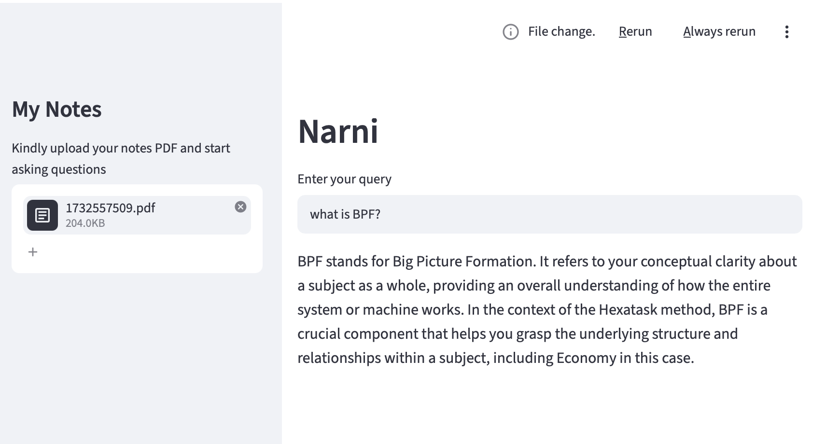

# Narni — AI-Powered Study Assistant (RAG Chatbot)

Narni is a document question-answering chatbot built with Retrieval-Augmented Generation (RAG). Upload your PDF notes and ask questions in plain language — Narni answers using **only** the content of your documents, not generic internet knowledge. Built as a study companion for exam preparation.

The entire pipeline runs **locally and free** — no paid API keys, no per-query costs — using open-source embedding and language models.

## Demo

<!-- Add a screenshot here. Drag an image into the GitHub editor, or commit it and reference it: -->


*Example: uploading study notes and asking "what is BPF?" — Narni answers directly from the uploaded PDF.*

## How It Works

Narni uses a standard RAG pipeline:

1. **Extract** — text is pulled from the uploaded PDF page by page.
2. **Chunk** — the text is split into overlapping segments so relevant passages can be retrieved precisely.
3. **Embed** — each chunk is converted into a vector embedding (a numeric representation of its meaning) using a local HuggingFace model.
4. **Store & Search** — embeddings are stored in a FAISS vector database. When you ask a question, the most semantically similar chunks are retrieved.
5. **Generate** — the retrieved chunks are passed as context to a local LLM (Llama 3.2 via Ollama) with a prompt that instructs it to answer only from those notes.

This grounding step is what keeps answers tied to your material and reduces hallucination.

## Tech Stack

| Component | Tool |
|-----------|------|
| UI | Streamlit |
| Orchestration | LangChain |
| PDF parsing | PyPDF2 |
| Embeddings | HuggingFace (`all-MiniLM-L6-v2`) |
| Vector store | FAISS |
| LLM | Ollama (Llama 3.2) |

## Setup

### Prerequisites
- Python 3.10+
- [Ollama](https://ollama.com/download) installed and running

### Install

```bash
# clone the repo
git clone https://github.com/Nithya1408/narni.git
cd narni

# install dependencies
pip install -r requirements.txt

# pull the local language model (one-time, ~2GB)
ollama pull llama3.2
```

### Run

```bash
# make sure the Ollama app is running, then:
streamlit run MyChatbot.py
```

The app opens in your browser. Upload a PDF, type a question, and Narni answers from your notes.

## Design Notes

- **Why local models?** The project originally used OpenAI's API, but I switched to local open-source models (HuggingFace embeddings + Ollama) to remove API costs and dependencies entirely — the app runs fully offline after the initial model download.
- **Prompt grounding.** A custom prompt template restricts the model to the retrieved context and returns a clear fallback message when the answer isn't found in the notes.

## Possible Improvements

- Persist the FAISS index to disk to avoid re-embedding on every upload
- Display source chunks alongside each answer
- Multi-PDF support and chat history

---

*Built as a hands-on project to learn RAG, vector search, and LLM application development.*
